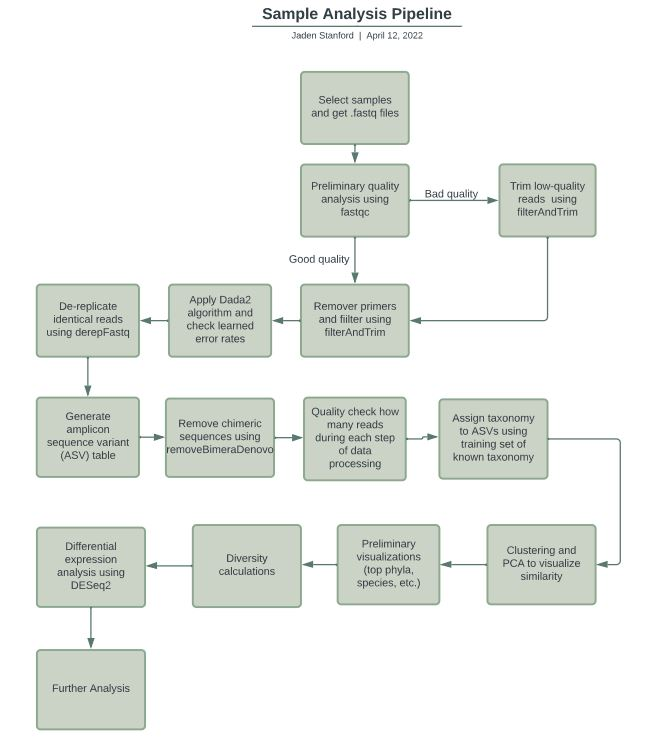

&nbsp;
&nbsp;
&nbsp;

## What is the microbiome?
```{r, echo = FALSE, out.height = '250px', out.width = '600px', fig.align='center'}
knitr::include_graphics('microbiome.jpg')

```


The human microbiota is the total of all microbial taxa associated with human beings and consists of an estimated 3 trillion microbes in each person. The microbiome is the catalog of these microbes and their genes. 

Microbiome analysis is within the area of metagenomics, which is the study of a collection of genetic material (genomes) from a mixed community of organisms. It offers a means of studying microbes within their own environments, which is advantageous especially since not all microbes can be cultured. Microbes are vital to the stability of an environment and have a variety of important functions that influence daily life, including modulating and maintaining the atmosphere, keeping humans healthy, and supporting plant growth. Metagenomics allow the study of complex ecological interactions that enable these microbial functions.

<br/>
<br/>

## Analysis Pipeline

The following flowchart gives a summary for the data processing pipeline I used for this project. 

```{r, echo = FALSE, out.height = '700px', out.width = '600px', fig.align='center'}


```

The first step is to obtain the samples that will be used in the analysis. I like to use samples in .fastq format. 

<br/>
<br/>


## Significant Results


### Diet

One of the significant results from the diet analysis was the initial cluster dendrogram, which shows some similarity in the microbiome exists with similar diet types. All of the vegetarian samples are within one big cluster, and the omnivore and pescetarian diets are clustered together as well. The vegan and vegetarian diets are also clustered together. This indicates as a preliminary result that diet type can potentially affect microbiome composition. 

```{r, echo = FALSE, out.height = '700px', out.width = '600px', fig.align='center'}
knitr::include_graphics('diet_cluster.png')

```
<br/>
This graph shows the top 20 species of bacteria that were found across the samples. 
```{r, echo = FALSE, out.height = '700px', out.width = '600px', fig.align='center'}
knitr::include_graphics('top20speciesdiet.png')

```

<br/>
<br/>


